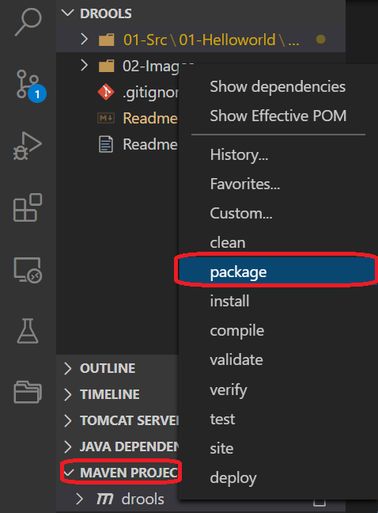
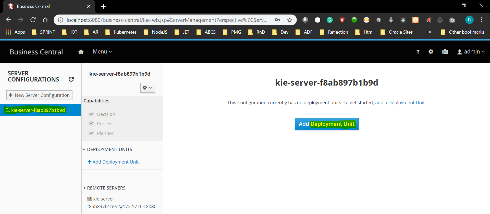

# Drools

## Table of Content
- [Overview](#overview)
- [Installation](#installation)
- [Modules](#modules)
- [Appendix](#appendix)

## Overview
- JBoss Drools is a **Business Rule Management System**. It is a framework where you can create rules that defines when a specific action should be done. 
- It can be used for applications where business rules can be externalized and will be uploaded by business users.
- 
- One of the major drawback of drools is it consumes lots of memory. 
- Drools execution workflow is split into two main parts:
  - **Authoring**: Authoring process involves the creation/setup of *Rule* files.
  - **Runtime**: It is creation of working memory and handling the activation.
- Fundamentals terminologies of drools:
  - **Rules**: These are part of knowledge that performs some tasks when specific conditions occur. These are defined as `.drl` files.
   
    ```drl
    rule  <rule_name>
    <attribute> <value>
        
    when
        <conditions>
        
    then
        <actions>
    end
    ```
    
  - **Knowledge Base**: It represents the knowledge in the Drools ecosystem which stores resources that form rules.
  - **Data Model**: It contains structure of data on which rules are applied. A data model is a set of java classes that define data types.
  - **Rule Engine**: It is a rule-based approach to implement an knowledge-based systems which can be used to make decisions. It is also refereed as **Production Rule System**.
  - **Facts**: It represents the data which serves as input for rules.
  - **Inference Engine**: This is the brain of *Rule Engine*. It can scale to number of rules and facts. It matches facts/data against *Rules*.
  - **Working Memory**: It is a storage of facts, where they are used for pattern matching. It can be modified, insert, and remove.
  - **Knowledge Session**: This component holds all the resources required for firing rule. Here, all facts are inserted into the single session, and then matching rules are fired.
  - **Module**: This is a module which stores multiple Knowledge Bases which can hold different sessions.
  - **Agenda**: It's a logical concept. The agenda is the logical place where rules are waiting to be fired.
  - **Activations**: It is the then part of the rules. These are placed in the `agenda` where the appropriate rule are fired.
  - **KIE**: "Knowledge Is Everything" is an umbrella project introduced to bring related technologies.
    - **KieContainer**: To work with kie technologies, we have to instantiate a KieContainer.
    - **KieSession**: We have to get it from the KieContainer to work with drools. This is used to give facts to the rule engine and fire rules.

---
## Installation
- **Setting Development Environment**
  - Install VSCode and below plugins
    - Java Extension Pack
    - Drools
  - Check out code from [modules](#modules)
  - Navigate to **MAVEN PROJECTS**  and click on **package**
  
  - Navigate to *\<Project\>->target->\<Project\>-1.0-SNAPSHOT.jar*, Mouse Right-Click and get *Copy Relative Path* and run `java -jar <relative-path>/<Project>-1.0-SNAPSHOT.jar`
- **Docker Based Installation**
  - Create a Oracle Linux 7 environment.
  - Execute below commands to run Drools Workbench
  
  ```shell
  # Creating base folders
  cd /scratch
  mkdir -m777 docker_storage
  mkdir -m777 wb_git
  
  # Adding Proxy Server Details
  vi ~/.bash_profile
    export http_proxy="http://<server>:<port>"
    export https_proxy="http://<server>:<port>"
    export no_proxy="localhost,127.0.0.1,.<orgextension>.com"
  
  # Setting up docker
  sudo su
    chmod 777 /var/run/docker.sock
    systemctl  stop docker
    /usr/sbin/usermod -a -G docker <login user>
    /usr/sbin/sysctl net.ipv4.conf.all.forwarding=1
    vi /etc/docker/daemon.json
        {
            "data-root":"/scratch/docker_storage"
        }
    systemctl  start docker
    exit
  
  # Checking Docker
  docker run hello-world

  # Executing Drool Workbench
  docker run -p 8080:8080 -p 8001:8001 -e JAVA_OPTS="-server -Xms1024m -Xmx1024m -Djava.net.preferIPv4Stack=true -Dfile.encoding=UTF-8" -v /scratch/wb_git:/opt/jboss/wildfly/bin/.niogit:Z -d --name drools-workbench jboss/drools-workbench-showcase:latest

  # Checking error in executions
  docker ps
  docker logs <container_id>
  ```
  
  - After successful execution of above script, drool workbench will be available [here](http://localhost:8080/business-central/kie-wb.jsp#) with user/pwd as `admin/admin`.
  - To install KIE Execution server using Docker, run below command. This will automatically make kie server enabled in drool workbench.
  ```shell
  docker run -p 8180:8080 -d --name kie-server --link drools-workbench:kie-wb jboss/kie-server-showcase:latest
  ``` 
  

---
## Modules
- Below are the example implementations of drools project.
  -  [01-HelloWorld](./01-Src/01-Helloworld)

---
## Appendix
- References
  - [Drools Overview](https://www.youtube.com/watch?v=fpMiZmvkItM)
  - [Kia Workbench - Medium](https://medium.com/@hasnat.saeed/setup-jboss-drools-workbench-and-kie-execution-server-on-wildfly-14-on-ubuntu-18-04-using-docker-e87b10f301ad)
  - [Redhat DRL](https://access.redhat.com/documentation/en-us/red_hat_process_automation_manager/7.0/html/designing_a_decision_service_using_drl_rules/index)